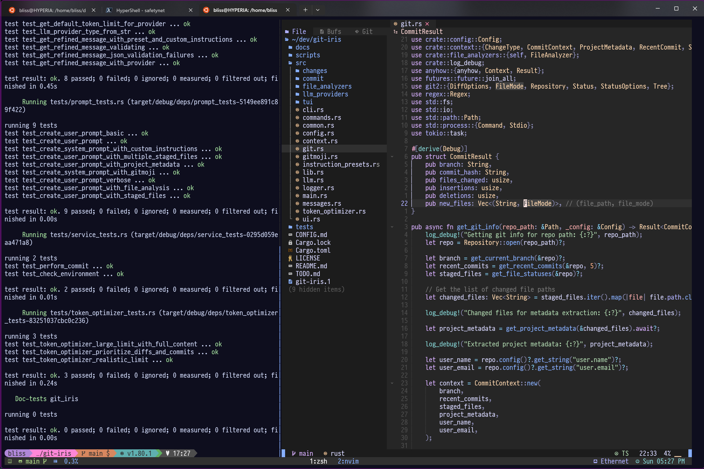

# 🌠 Stefanie's Dotfiles

<p align="center">
  
  
  
  
  
</p>

Hey there! Welcome to my personal dotfiles repository! I'm **Stefanie Jane**, aka **hyperb1iss**—a creative tech enthusiast based in Seattle. These dotfiles create a powerful, consistent development environment that works seamlessly across Linux, WSL2, and Windows, with a special focus on Android development.

<p align="center">
  
</p>

<p align="center">
  
</p>

## 🌟 Core Features

| Feature                    | Description                                                                                                                                                                          |
| -------------------------- | ------------------------------------------------------------------------------------------------------------------------------------------------------------------------------------ |
| 🐚 **Shell Environment**   | • Unified Bash & Zsh configuration<br>• Smart shell detection and adaptation<br>• Enhanced history with timestamps<br>• Modern CLI tools integration<br>• Cross-platform consistency |
| 📱 **Android Development** | • Complete AOSP build environment<br>• Smart device management<br>• Optimized build commands<br>• Comprehensive udev rules<br>• Quick navigation system                              |
| 🖥️ **Terminal Setup**      | • Custom Tmux configuration<br>• Starship prompt with Git integration<br>• Modern CLI replacements<br>• Fuzzy finding and completion<br>• Directory jumping                          |
| 🪟 **WSL2 Integration**    | • Seamless Windows/Linux operation<br>• Path conversion utilities<br>• File system integration<br>• Shared Git configuration<br>• Backup tools                                       |
| 🎨 **Theming**             | • Dracula-inspired color scheme<br>• Custom Elektra theme for Macchina<br>• Consistent cross-tool styling<br>• Beautiful CLI visuals<br>• Custom icons and highlights                |
| 🛠️ **Development Tools**   | • AstroNvim configuration<br>• Git workflow enhancements<br>• Docker management<br>• Build automation<br>• Performance optimizations                                                 |

## 🔧 Tool Suite

### 📊 Core Development

| Tool                                        | Description          | Features                                                                      |
| ------------------------------------------- | -------------------- | ----------------------------------------------------------------------------- |
| 🚀 **[Starship](https://starship.rs/)**     | Cross-shell prompt   | • Custom prompt design<br>• Git status integration<br>• Context-aware display |
| 📝 **[AstroNvim](https://astronvim.com/)**  | Neovim configuration | • IDE-like features<br>• Custom plugins<br>• Intelligent completions          |
| 🖥️ **[Tmux](https://github.com/tmux/tmux)** | Terminal multiplexer | • Custom key bindings<br>• Status bar configuration<br>• Session management   |

### 🎯 Modern CLI Tools

| Tool                                                    | Description   | Features                                                          |
| ------------------------------------------------------- | ------------- | ----------------------------------------------------------------- |
| 🌳 **[FZF](https://github.com/junegunn/fzf)**           | Fuzzy finder  | • File searching<br>• History exploration<br>• Command completion |
| 📂 **[LSDeluxe](https://github.com/Peltoche/lsd)**      | Modern ls     | • Icon support<br>• Color coding<br>• Tree view                   |
| 🎨 **[Bat](https://github.com/sharkdp/bat)**            | Enhanced cat  | • Syntax highlighting<br>• Git integration<br>• Line numbering    |
| 🔍 **[Ripgrep](https://github.com/BurntSushi/ripgrep)** | Fast searcher | • Code searching<br>• Regular expressions<br>• Ignore rules       |

### 🖼️ System & Customization

| Tool                                                        | Description    | Features                                                              |
| ----------------------------------------------------------- | -------------- | --------------------------------------------------------------------- |
| 📊 **[Macchina](https://github.com/Macchina-CLI/macchina)** | System info    | • Custom Elektra theme<br>• Performance metrics<br>• System details   |
| 🎯 **[HyperShell](./hypershell)**                           | PowerShell env | • Linux-like experience<br>• Custom aliases<br>• WSL integration      |
| 🔧 **[DotBot](https://github.com/anishathalye/dotbot)**     | Config manager | • Automated setup<br>• Cross-platform support<br>• Profile management |

## 📁 Repository Structure

```
dotfiles/
├── zsh/                  # Zsh configuration
├── bash/                 # Bash configuration
├── sh/                   # Shared shell utilities
│   ├── android.sh       # Android development tools
│   └── shell-utils.sh   # Common shell functions
├── hypershell/          # Windows PowerShell environment
├── nvim/                # AstroNvim configuration
├── tmux.conf            # Tmux configuration
├── starship/            # Starship prompt themes
├── elektra/             # Custom Macchina theme
└── bin/                 # Utility scripts
```

## 🔤 Installing Nerd Fonts

Nerd Fonts are required for proper icon display in the terminal. These are not automatically installed by dotbot. Follow these steps to install them:

1. Visit the [Nerd Fonts website](https://www.nerdfonts.com/)
2. Download your preferred font (I recommend JetBrainsMono Nerd Font)
3. Extract the downloaded zip file
4. Install the fonts:
   - On Windows: Right-click on each `.ttf` file and select "Install"
   - On macOS: Double-click each `.ttf` file and click "Install Font"
   - On Linux: Copy the `.ttf` files to `~/.local/share/fonts/` and run `fc-cache -fv`
5. Configure your terminal to use the installed Nerd Font

For WSL2 users, make sure to set the Nerd Font in your Windows Terminal settings as well.

## 🛠️ Installation

### Linux/WSL2

```bash
# Clone the repository
git clone https://github.com/hyperb1iss/dotfiles.git ~/dev/dotfiles

# Install everything
cd ~/dev/dotfiles
make
```

### macOS

```bash
# Option 1: Using the installer script
bash -c "$(curl -fsSL https://raw.githubusercontent.com/hyperb1iss/dotfiles/main/install_macos.sh)"

# Option 2: Manual installation
# Clone the repository
git clone https://github.com/hyperb1iss/dotfiles.git ~/dev/dotfiles

# Install everything
cd ~/dev/dotfiles
make macos
```

### Windows

```powershell
# Clone the repository
git clone https://github.com/hyperb1iss/dotfiles.git $env:USERPROFILE\dev\dotfiles

# Install as administrator
cd $env:USERPROFILE\dev\dotfiles
.\install.bat
```

## 🚀 Deep Dive

### 🐚 Shell Environment

The shell environment provides a unified experience across Bash and Zsh:

```bash
# Modern CLI Usage Examples
ls                # Beautiful file listings with icons
ll                # Detailed list view
lt                # Tree view of directories
bat script.sh     # Syntax-highlighted file viewing
z projects        # Smart directory jumping
fzf               # Fuzzy find files or history
```

**Key Features:**

- Unified configuration across Bash and Zsh
- Enhanced history with timestamps and duplicate removal
- Intelligent tab completion with fuzzy finding
- Directory jumping with `z` command
- Cross-platform environment variables
- Smart aliases that work everywhere

### 📱 Android Development

Comprehensive tooling for AOSP and device development:

```bash
# Environment Setup
envsetup                     # Initialize build environment
lunch aosp_pixel-userdebug   # Select build target

# Building
mka bacon                    # Optimized build command
installboot                  # Smart boot image installation

# Device Management
logcat                      # Smart device selection
apush system.img            # Intelligent file pushing
aospremote                  # Configure AOSP remote
cafremote                   # Configure CAF remote

# Navigation
gokernel                    # Jump to kernel directory
govendor                    # Jump to vendor directory
goapps                      # Jump to packages/apps
```

**Key Features:**

- Automated build environment setup
- Smart device detection and management
- Performance-optimized build commands
- Comprehensive udev rules
- Quick navigation aliases

### 🪟 WSL2 Integration

Seamless Windows and Linux integration:

```bash
# Path Conversion
wslpath "C:\Users\Stefanie"  # Convert Windows to WSL path
wslopen ~/projects           # Open WSL path in Windows Explorer

# Navigation
cdw                         # Jump to Windows user directory

# File Operations
apush file.txt              # Smart file pushing to Android
extract archive.tar.gz      # Smart archive extraction
```

**Key Features:**

- Seamless path conversion
- File system integration
- Shared Git configuration
- WSL backup utilities
- Cross-platform clipboard support

### 🤖 HyperShell (PowerShell)

A Linux-like experience for Windows PowerShell:

```powershell
# Linux-style Commands
ls --tree         # Directory tree with icons
grep "pattern"    # Search with ripgrep
which code        # Find executable paths

# Docker Management
dex container     # Interactive container selection
dlog container    # View container logs
dstop container   # Stop containers
```

**Key Features:**

- Linux command aliases
- WSL integration
- Docker management
- Modern CLI tools
- Custom prompt and themes

### 🎨 Theming System

The environment uses a carefully crafted theme based on the Dracula color palette. Each color has been specially tuned for optimal visibility and aesthetic appeal:

|                         Color Preview                         | Name             | Hex Code  | Usage                            |
| :-----------------------------------------------------------: | ---------------- | --------- | -------------------------------- |
|    | **Background**   | `#282a36` | Terminal background, editor base |
|  | **Current Line** | `#44475a` | Active line highlighting         |
|    | **Foreground**   | `#f8f8f2` | Primary text color               |
|       | **Comment**      | `#6272a4` | Comments and secondary elements  |
|          | **Cyan**         | `#5fb7c2` | Symbols and constants            |
|         | **Green**        | `#3ac165` | Strings and success states       |
|        | **Orange**       | `#d99a5e` | Numbers and warning states       |
|          | **Pink**         | `#d664a6` | Functions and special keywords   |
|        | **Purple**       | `#9d7cd6` | Keywords and headings            |
|           | **Red**          | `#ff5555` | Errors and deletions             |
|        | **Yellow**       | `#f1fa8c` | Classes and variables            |

This color scheme is consistently applied across the entire environment:

- **Terminal** - Background, text, and highlighting colors
- **Starship Prompt** - Status indicators and segment colors
- **Elektra Theme** - System information display
- **LSDeluxe** - File type and permission colors
- **Bat** - Syntax highlighting
- **Tmux** - Status bar and active window indicators
- **Git** - Status and diff coloring

The theme provides excellent contrast and readability while maintaining a cohesive and beautiful aesthetic across all tools and interfaces.

## 🔄 Updating

To update the dotfiles repository:

```bash
cd ~/dev/dotfiles
git pull
make  # For Linux/WSL2
# Or
.\install.bat  # For Windows (run as administrator)
```

## 🤝 Contributing

Got ideas for improvements? Found a bug? Feel free to:

1. Fork the repository
2. Create a feature branch
3. Make your changes
4. Submit a pull request

## 🚀 Other Projects

If you like these dotfiles, you might be interested in some of my other projects:

- [git-iris](https://github.com/hyperb1iss/git-iris): AI-accelerated git workflow tool
- [signalrgb-homeassistant](https://github.com/hyperb1iss/signalrgb-homeassistant): SignalRGB integration for Home Assistant
- [signalrgb-python](https://github.com/hyperb1iss/signalrgb-python): Python API client for SignalRGB Pro
- [hyper-light-card](https://github.com/hyperb1iss/hyper-light-card): Custom card for controlling SignalRGB through Home Assistant
- [contexter](https://github.com/hyperb1iss/contexter): Chrome extension and CLI for quickly copying code into LLMs
- [aeonsync](https://github.com/hyperb1iss/aeonsync): An rsync backup tool for developers

## 📜 License

This project is open source and available under the [MIT License](LICENSE).

---

<div align="center">

Created by [Stefanie Jane 🌠](https://github.com/hyperb1iss)

If you find these dotfiles helpful, [buy me a Monster Ultra Violet](https://ko-fi.com/hyperb1iss)! ⚡️

</div>
