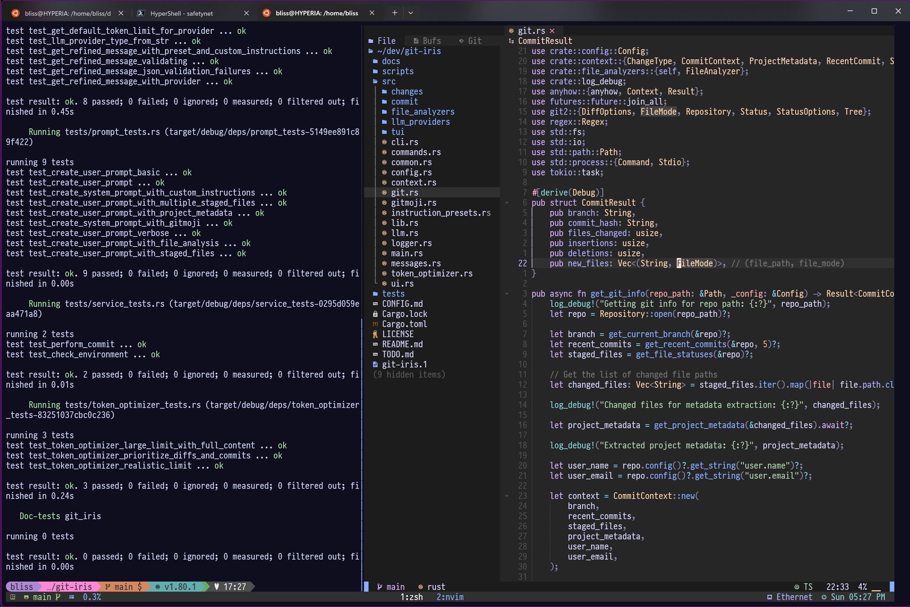

# 🌠 Stefanie's Dotfiles

<p align="center">
  
  
  
  
  
</p>

Hey there! Welcome to my personal dotfiles repository! I'm **Stefanie Jane**, aka **hyperb1iss**—a creative technologist
based in Seattle. These dotfiles create a powerful, consistent development environment that works seamlessly across
Linux, WSL2, and Windows, with a special focus on Android development.

<p align="center">
  
</p>

## 🌟 Core Features

| Feature                    | Description                                                                                                                                                                          |
| -------------------------- | ------------------------------------------------------------------------------------------------------------------------------------------------------------------------------------ |
| 🐚 **Shell Environment**   | • Unified Bash & Zsh configuration<br>• Smart shell detection and adaptation<br>• Enhanced history with timestamps<br>• Modern CLI tools integration<br>• Cross-platform consistency |
| 📱 **Android Development** | • Complete AOSP build environment<br>• Smart device management<br>• Optimized build commands<br>• Comprehensive udev rules<br>• Quick navigation system                              |
| 🖥️ **Terminal Setup**      | • Custom Tmux configuration<br>• Starship prompt with Git integration<br>• Modern CLI replacements<br>• Fuzzy finding and completion<br>• Directory jumping                          |
| 🪟 **WSL2 Integration**    | • Seamless Windows/Linux operation<br>• Path conversion utilities<br>• File system integration<br>• Shared Git configuration<br>• Backup tools                                       |
| 🎨 **Theming**             | • SilkCircuit custom color scheme<br>• SilkCircuit Starship theme<br>• Consistent cross-tool styling<br>• Beautiful CLI visuals<br>• Neon magenta & electric cyan accents            |
| 🛠️ **Development Tools**   | • AstroNvim + Avante.nvim AI assistant<br>• Git workflow enhancements<br>• Docker & Kubernetes management<br>• Build automation<br>• Performance optimizations                       |

## 🔧 Tool Suite

### 📊 Core Development

| Tool                                        | Description          | Features                                                                      |
| ------------------------------------------- | -------------------- | ----------------------------------------------------------------------------- |
| 🚀 **[Starship](https://starship.rs/)**     | Cross-shell prompt   | • SilkCircuit theme<br>• Git status integration<br>• Context-aware display    |
| 📝 **[AstroNvim](https://astronvim.com/)**  | Neovim configuration | • IDE-like features<br>• Avante.nvim AI assistant<br>• SilkCircuit theme      |
| 🖥️ **[Tmux](https://github.com/tmux/tmux)** | Terminal multiplexer | • Custom key bindings<br>• SilkCircuit color scheme<br>• Session management   |
| ✨ **[shellint](./bin/shellint)**           | Shell script linter  | • Shellcheck integration<br>• Auto-fixing capabilities<br>• Format with shfmt |

### 🎯 Modern CLI Tools

| Tool                                                    | Description   | Features                                                          |
| ------------------------------------------------------- | ------------- | ----------------------------------------------------------------- |
| 🌳 **[FZF](https://github.com/junegunn/fzf)**           | Fuzzy finder  | • File searching<br>• History exploration<br>• Command completion |
| 📂 **[LSDeluxe](https://github.com/Peltoche/lsd)**      | Modern ls     | • Icon support<br>• SilkCircuit colors<br>• Tree view             |
| 🎨 **[Bat](https://github.com/sharkdp/bat)**            | Enhanced cat  | • Syntax highlighting<br>• SilkCircuit theme<br>• Line numbering  |
| 🔍 **[Ripgrep](https://github.com/BurntSushi/ripgrep)** | Fast searcher | • Code searching<br>• Regular expressions<br>• Ignore rules       |

### 🖼️ System & Customization

| Tool                                                        | Description    | Features                                                              |
| ----------------------------------------------------------- | -------------- | --------------------------------------------------------------------- |
| 📊 **[Fastfetch](https://github.com/fastfetch-cli/fastfetch)** | System info | • Fast system information<br>• Performance metrics<br>• Custom config |
| 🎯 **[HyperShell](./hypershell)**                           | PowerShell env | • Modular architecture<br>• Kubernetes support<br>• Zoxide & FZF      |
| 🔧 **[DotBot](https://github.com/anishathalye/dotbot)**     | Config manager | • Automated setup<br>• Cross-platform support<br>• Profile management |

## 📁 Repository Structure

```
dotfiles/
├── zsh/                  # Zsh configuration
├── bash/                 # Bash configuration
├── sh/                   # Shared shell utilities
│   ├── android.sh       # Android development tools
│   └── shell-utils.sh   # Common shell functions
├── hypershell/          # Windows PowerShell environment
├── nvim/                # AstroNvim configuration
├── tmux.conf            # Tmux configuration
├── starship/            # Starship prompt themes
├── fastfetch/           # Fastfetch system info config
└── bin/                 # Utility scripts
```

## 🔤 Installing Nerd Fonts

Nerd Fonts are required for proper icon display in the terminal. These are not automatically installed by dotbot. Follow
these steps to install them:

1. Visit the [Nerd Fonts website](https://www.nerdfonts.com/)
2. Download your preferred font (I recommend JetBrainsMono Nerd Font)
3. Extract the downloaded zip file
4. Install the fonts:
   - On Windows: Right-click on each `.ttf` file and select "Install"
   - On macOS: Double-click each `.ttf` file and click "Install Font"
   - On Linux: Copy the `.ttf` files to `~/.local/share/fonts/` and run `fc-cache -fv`
5. Configure your terminal to use the installed Nerd Font

For WSL2 users, make sure to set the Nerd Font in your Windows Terminal settings as well.

## 🛠️ Installation

### Linux/WSL2

```bash
# Clone the repository
git clone https://github.com/hyperb1iss/dotfiles.git ~/dev/dotfiles

# Install everything
cd ~/dev/dotfiles
make
```

### macOS

```bash
# Option 1: Using the installer script
bash -c "$(curl -fsSL https://raw.githubusercontent.com/hyperb1iss/dotfiles/main/install_macos.sh)"

# Option 2: Manual installation
# Clone the repository
git clone https://github.com/hyperb1iss/dotfiles.git ~/dev/dotfiles

# Install everything
cd ~/dev/dotfiles
make macos
```

### Windows

```powershell
# Clone the repository
git clone https://github.com/hyperb1iss/dotfiles.git $env:USERPROFILE\dev\dotfiles

# Install as administrator
cd $env:USERPROFILE\dev\dotfiles
.\install.bat
```

## 🚀 Deep Dive

### 🐚 Shell Environment

The shell environment provides a unified experience across Bash and Zsh:

```bash
# Modern CLI Usage Examples
ls                # Beautiful file listings with icons
ll                # Detailed list view
lt                # Tree view of directories
bat script.sh     # Syntax-highlighted file viewing
z projects        # Smart directory jumping
fzf               # Fuzzy find files or history
```

**Key Features:**

- Unified configuration across Bash and Zsh with Zinit plugin management
- Enhanced history with timestamps and duplicate removal
- Intelligent tab completion with fuzzy finding
- Directory jumping with `z` command and bookmarking system
- Git worktree manager (`gwt`) with comprehensive subcommands
- Interactive FZF functions for files, processes, and Docker
- Cross-platform environment variables and platform detection

### 📱 Android Development

Comprehensive tooling for AOSP and device development:

```bash
# Environment Setup
envsetup                     # Initialize build environment
lunch aosp_pixel-userdebug   # Select build target

# Building
mka bacon                    # Optimized build command
installboot                  # Smart boot image installation

# Device Management
logcat                      # Smart device selection
apush system.img            # Intelligent file pushing
aospremote                  # Configure AOSP remote
cafremote                   # Configure CAF remote

# Navigation
gokernel                    # Jump to kernel directory
govendor                    # Jump to vendor directory
goapps                      # Jump to packages/apps
```

**Key Features:**

- Automated build environment setup
- Smart device detection and management
- Performance-optimized build commands
- Comprehensive udev rules
- Quick navigation aliases

### 🪟 WSL2 Integration

Seamless Windows and Linux integration:

```bash
# Path Conversion
wslpath "C:\Users\Stefanie"  # Convert Windows to WSL path
wslopen ~/projects           # Open WSL path in Windows Explorer

# Navigation
cdw                         # Jump to Windows user directory

# File Operations
apush file.txt              # Smart file pushing to Android
extract archive.tar.gz      # Smart archive extraction
```

**Key Features:**

- Seamless path conversion
- File system integration
- Shared Git configuration
- WSL backup utilities
- Cross-platform clipboard support

### 🤖 HyperShell (PowerShell)

A Linux-like experience for Windows PowerShell:

```powershell
# Linux-style Commands
ls --tree         # Directory tree with icons
grep "pattern"    # Search with ripgrep
which code        # Find executable paths

# Docker Management
dex container     # Interactive container selection
dlog container    # View container logs
dstop container   # Stop containers
```

**Key Features:**

- Modular architecture with 13 specialized modules
- Linux command aliases using GNU tools
- Kubernetes support with kubectl aliases and k9s
- Zoxide for smart directory navigation
- Android development utilities
- HyperShell branding with SilkCircuit theme
- Advanced FZF integration and Docker management

### 🤖 AI Integration

The environment includes advanced AI coding assistance through **Avante.nvim**, providing:

- **Claude Integration**: Configured with Claude Sonnet 4 for intelligent code suggestions
- **Interactive Sidebar**: Right-positioned AI assistant with rounded borders
- **Smart Diff Resolution**: Intelligent conflict resolution with keyboard shortcuts
- **Navigation**: Easy movement between AI suggestions and code changes
- **Manual Control**: Auto-suggestions disabled for better control over AI assistance

### 🎨 Theming System - SilkCircuit

The environment features the custom **SilkCircuit** color scheme, a cyberpunk-inspired theme with neon accents:

|                          Color Preview                          | Name               | Hex Code  | Usage                                   |
| :-------------------------------------------------------------: | ------------------ | --------- | --------------------------------------- |
|      | **Background**     | `#1a1a2e` | Terminal background, deep space purple  |
|    | **Neon Magenta**   | `#ff00ff` | Current branches, prompts, highlights   |
|   | **Electric Cyan**  | `#00ffff` | Local branches, help text, dates        |
|  | **Bright Magenta** | `#ff79c6` | Changed files, authors, remote branches |
|          | **Yellow**         | `#ffdc00` | Branch decorations, code files          |
|           | **Green**          | `#50fa7b` | Added files, executables                |
|             | **Red**            | `#ff5555` | Deleted files, errors                   |
|          | **Purple**         | `#c792ea` | Keywords, tmux accents                  |

The SilkCircuit theme is consistently applied across the entire environment:

- **Neovim** - Full theme integration with 30+ plugin support
- **Git** - Custom log formatting with `silkcircuit` pretty format
- **Starship Prompt** - SilkCircuit theme with gradient effects
- **LSDeluxe** - File type colors matching the theme
- **Bat** - Custom SilkCircuit.tmTheme for syntax highlighting
- **Tmux** - Status bar with purple and pink accents
- **Delta** - Git diff viewer with themed colors

The theme provides a striking cyberpunk aesthetic with excellent contrast and readability across all tools.

## 🔄 Updating

To update the dotfiles repository:

```bash
cd ~/dev/dotfiles
git pull
make  # For Linux/WSL2
# Or
.\install.bat  # For Windows (run as administrator)
```

## 🤝 Contributing

Got ideas for improvements? Found a bug? Feel free to:

1. Fork the repository
2. Create a feature branch
3. Make your changes
4. Submit a pull request

## 🚀 Other Projects

If you like these dotfiles, you might be interested in some of my other projects:

- [git-iris](https://github.com/hyperb1iss/git-iris): AI-accelerated git workflow tool
- [signalrgb-homeassistant](https://github.com/hyperb1iss/signalrgb-homeassistant): SignalRGB integration for Home
  Assistant
- [signalrgb-python](https://github.com/hyperb1iss/signalrgb-python): Python API client for SignalRGB Pro
- [hyper-light-card](https://github.com/hyperb1iss/hyper-light-card): Custom card for controlling SignalRGB through Home
  Assistant
- [contexter](https://github.com/hyperb1iss/contexter): Chrome extension and CLI for quickly copying code into LLMs
- [aeonsync](https://github.com/hyperb1iss/aeonsync): An rsync backup tool for developers

## 📜 License

This project is open source and available under the [MIT License](LICENSE).

---

<div align="center">

Created by [Stefanie Jane 🌠](https://github.com/hyperb1iss)

If you find these dotfiles helpful, [buy me a Monster Ultra Violet](https://ko-fi.com/hyperb1iss)! ⚡️

</div>
