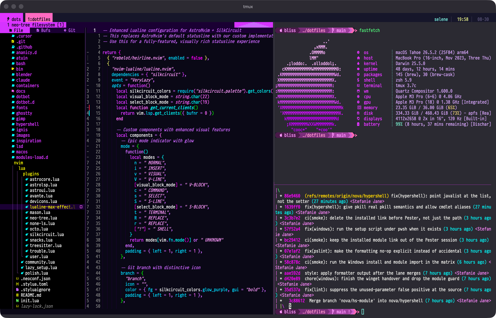
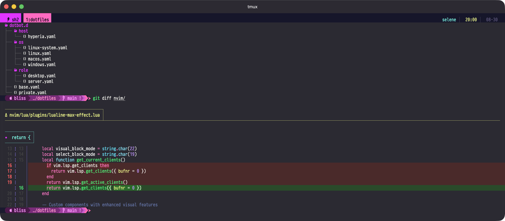

# 🌠 Stefanie's Dotfiles

<!-- markdownlint-disable MD013 -->

<p align="center">
  <a href="https://hyperb1iss.github.io/dotfiles/"></a>
  <a href="LICENSE"></a>
</p>

<p align="center">
  
  
  <a href="https://astronvim.com/"></a>
  <a href="https://ghostty.org/"></a>
  <a href="https://starship.rs/"></a>
  <a href="https://github.com/hyperb1iss/silkcircuit-nvim"></a>
</p>

<!-- markdownlint-enable MD013 -->

Hey there! I'm **Stefanie Jane**, aka **[hyperb1iss](https://github.com/hyperb1iss)**, a creative technologist in
Seattle. These dotfiles turn a fresh machine into a fully themed, fully wired workstation on **macOS, Linux, Windows, or
WSL2**. The Unix side runs Zsh with a modular script library; Windows gets the same energy through **HyperShell**, a
real PowerShell module with Linux-shaped commands. Everything wears
[SilkCircuit](https://github.com/hyperb1iss/silkcircuit-nvim), a cyberpunk color system of neon purples, electric cyans,
and blazing pinks that flows through every tool from Neovim to git diffs.

This README is the tour. The field manual lives at
**[hyperb1iss.github.io/dotfiles](https://hyperb1iss.github.io/dotfiles/)** 📚

<p align="center">
  
</p>

## 🌟 Core Features

| Feature                  | Description                                                                                                                                                                                                      |
| ------------------------ | ---------------------------------------------------------------------------------------------------------------------------------------------------------------------------------------------------------------- |
| 🐚 **Shell Environment** | • Zsh with Zinit plugin management & Bash fallback<br>• Atuin shell history with cross-machine sync<br>• 30 modular shell scripts with 150+ aliases<br>• Smart platform detection & adaptation                   |
| 🖥️ **Terminal Setup**    | • Ghostty terminal with SilkCircuit theme<br>• Tmux multiplexer with custom keybindings<br>• Starship prompt with gradient theme<br>• FZF-powered fuzzy finding everywhere                                       |
| 🤖 **AI Integration**    | • Claude Code CLI for terminal AI pair programming<br>• Avante.nvim for in-editor Claude assistance<br>• Custom Claude Code status line & security hooks                                                         |
| 🎨 **SilkCircuit Theme** | • [silkcircuit-nvim](https://github.com/hyperb1iss/silkcircuit-nvim) Neovim colorscheme<br>• Consistent theming across Neovim, Git, Starship, Tmux, Ghostty, Bat, Delta, Atuin, FZF, and more                    |
| 🛠️ **Development Tools** | • AstroNvim v5 with Mason-managed LSP, formatters, and debuggers<br>• Proto version manager with per-project pins<br>• Git workflow enhancements with Delta diffs<br>• Docker & Kubernetes management            |
| 🌐 **Cross-Platform**    | • macOS with Homebrew & DotBot automation<br>• Linux (Ubuntu/Arch) full desktop & minimal server profiles<br>• Windows via install.ps1, winget, and the HyperShell module<br>• WSL2 with two-way path conversion |

## 🔧 Tool Suite

### 📊 Core Development

| Tool                                                                 | Description          | Features                                                                    |
| -------------------------------------------------------------------- | -------------------- | --------------------------------------------------------------------------- |
| 📝 **[AstroNvim v5](https://astronvim.com/)**                        | Neovim configuration | • IDE-like features<br>• Avante.nvim AI assistant<br>• SilkCircuit theme    |
| 👻 **[Ghostty](https://ghostty.org/)**                               | Terminal emulator    | • GPU-accelerated<br>• SilkCircuit theme<br>• Native macOS/Linux            |
| 🌌 **[Starship](https://starship.rs/)**                              | Cross-shell prompt   | • SilkCircuit gradient theme<br>• Git status integration<br>• Context-aware |
| 🖥️ **[Tmux](https://github.com/tmux/tmux)**                          | Terminal multiplexer | • Custom key bindings<br>• SilkCircuit color scheme<br>• Session management |
| 🤖 **[Claude Code](https://docs.anthropic.com/en/docs/claude-code)** | AI pair programmer   | • Custom status line<br>• Security hooks<br>• Project-aware assistance      |

### 🎯 Modern CLI Tools

| Tool                                                    | Description     | Features                                                              |
| ------------------------------------------------------- | --------------- | --------------------------------------------------------------------- |
| 🌳 **[FZF](https://github.com/junegunn/fzf)**           | Fuzzy finder    | • File searching<br>• History exploration<br>• Command completion     |
| 📂 **[LSDeluxe](https://github.com/Peltoche/lsd)**      | Modern ls       | • Icon support<br>• SilkCircuit colors<br>• Tree view                 |
| 🎨 **[Bat](https://github.com/sharkdp/bat)**            | Enhanced cat    | • Syntax highlighting<br>• SilkCircuit theme<br>• Line numbering      |
| 🔍 **[Ripgrep](https://github.com/BurntSushi/ripgrep)** | Fast searcher   | • Code searching<br>• Regular expressions<br>• Ignore rules           |
| 🔀 **[Delta](https://github.com/dandavison/delta)**     | Git diff viewer | • Syntax highlighting<br>• Side-by-side diffs<br>• SilkCircuit theme  |
| ⏪ **[Atuin](https://atuin.sh/)**                       | Shell history   | • SQLite-backed<br>• Cross-machine sync<br>• Per-directory filtering  |
| 📌 **[Zoxide](https://github.com/ajeetdsouza/zoxide)**  | Smart cd        | • Learns your habits<br>• Fuzzy matching<br>• Instant directory jumps |
| 🔧 **[Proto](https://moonrepo.dev/proto)**              | Version manager | • Node, Python, pnpm & more<br>• Auto .prototools detection<br>• Fast |

### 🖼️ System & Customization

| Tool                                                           | Description    | Features                                                              |
| -------------------------------------------------------------- | -------------- | --------------------------------------------------------------------- |
| 📊 **[Fastfetch](https://github.com/fastfetch-cli/fastfetch)** | System info    | • Fast system information<br>• Performance metrics<br>• Themed config |
| 🪄 **[shellint](./bin/shellint)**                              | Shell linter   | • Shellcheck integration<br>• Auto-fixing<br>• Format with shfmt      |
| 🔧 **[DotBot](https://github.com/anishathalye/dotbot)**        | Config manager | • Automated setup<br>• Cross-platform support<br>• Profile management |

## 📁 Repository Structure

```
dotfiles/
├── nvim/                 # AstroNvim v5 configuration (→ ~/.config/nvim)
│   └── lua/plugins/      #   Plugin configs (silkcircuit, avante, treesitter, …)
├── zsh/                  # Zsh configuration (zshrc + completion)
├── bash/                 # Bash configuration (profile + bashrc.local)
├── sh/                   # 30 modular shell scripts (git, docker, k8s, macos, …)
├── bin/                  # Utility scripts (shellint, pkg-sync, scrape, …)
├── ghostty/              # Ghostty terminal config (macOS + Linux)
├── modules-load.d/       # Kernel modules loaded at boot (tcp_bbr)
├── tmux.conf             # Tmux multiplexer configuration
├── atuin/                # Atuin shell history + SilkCircuit theme
├── gitconfig             # Git config with SilkCircuit colors + Delta
├── proto/                # Proto version manager (.prototools)
├── claude/               # Claude Code settings, status line, security hooks
├── lsd/                  # LSDeluxe layout (colors come from SilkCircuit)
├── macos/                # macOS setup (Brewfile, system prefs, Karabiner)
├── hypershell/           # HyperShell, the Windows PowerShell module
├── docs/                 # VitePress documentation site
├── packages.conf         # Every apt, pacman, cargo, and winget package, by role
├── Makefile              # Install, lint, and format targets
└── dotbot.d/             # DotBot install layers
    ├── base.yaml         #   Every machine, every OS, every role
    ├── os/               #   macos, linux, windows, linux-system (the sudo tier)
    ├── role/             #   desktop, server
    ├── host/             #   Per-machine overrides, keyed by hostname
    └── private.yaml      #   dotfiles-private overlay
```

### 🌊 How the Layers Compose

Installation is one DotBot run over a stack of layers, picked for the machine you are standing on:

```
base.yaml → os/<uname>.yaml → role/<role>.yaml → host/<hostname>.yaml → private.yaml
```

The Makefile detects the OS from `uname`, defaults the role to `desktop`, and appends the host and private layers only
when those files exist. Each layer answers one question, so a shared change lives in exactly one file instead of three.
Windows runs a single layer, `os/windows.yaml`, through `install.ps1`, since the shared layers assume Unix paths. The
full walkthrough is in [the installation guide](https://hyperb1iss.github.io/dotfiles/getting-started/installation).

<p align="center">
  
</p>

### 📦 One Package Manifest

Every apt, pacman, cargo, and winget package lives in [`packages.conf`](./packages.conf), one row per tool, carrying the
name each manager uses and the roles it belongs to. [`bin/pkg-sync`](./bin/pkg-sync) resolves the manifest and runs the
install using nothing but bash and awk, so it works on a box that has not installed anything yet. Windows reads the same
manifest through [`bin/pkg-sync.ps1`](./bin/pkg-sync.ps1).

```bash
bin/pkg-sync list apt server           # what a headless Ubuntu box gets
bin/pkg-sync install pacman desktop -n # the plan, without running it
bin/pkg-sync install desktop           # detect the manager, install for real
```

Homebrew is the exception and keeps its own declarative manifest in [`macos/Brewfile`](./macos/Brewfile), because casks,
taps, and mas entries would flatten in this format.

## 🔤 Nerd Fonts

Terminal icons need a [Nerd Font](https://www.nerdfonts.com/), and the installer deliberately stays out of the font
business. Grab one (JetBrainsMono is a solid default), install it, and point your terminal at it. On WSL2, set the font
in Windows Terminal too.

## 🛠️ Installation

### macOS

```bash
# Option 1: The installer script
bash -c "$(curl -fsSL https://raw.githubusercontent.com/hyperb1iss/dotfiles/main/install_macos.sh)"

# Option 2: Manual
git clone https://github.com/hyperb1iss/dotfiles.git ~/dev/dotfiles
cd ~/dev/dotfiles
make install
```

### Linux/WSL2

```bash
git clone https://github.com/hyperb1iss/dotfiles.git ~/dev/dotfiles
cd ~/dev/dotfiles

# Install everything, system tier included
make full

# Or skip the sudo tier and install just the user layers
make install
```

`make install` composes the right layers for whatever machine it runs on, so it is the one command worth remembering.
Headless boxes want `make server`.

### Windows

```powershell
git clone https://github.com/hyperb1iss/dotfiles.git $env:USERPROFILE\dev\dotfiles
cd $env:USERPROFILE\dev\dotfiles

# Windows PowerShell 5.1 ships a Restricted execution policy on client
# editions, so a fresh box needs the bypass for the first run
powershell -ExecutionPolicy Bypass -File .\install.ps1
```

`install.ps1` is the Windows `make install`. It initializes the submodules, installs the winget rows of `packages.conf`
for the role, runs the Windows DotBot layer, and records the role for next time. Administrator is detected, not
demanded: only setting the default WSL version needs elevation, and an unelevated run says so by name and installs
everything else.

```powershell
.\install.ps1 -Role server      # the smaller winget set, for Windows Server
.\install.ps1 -SkipPackages     # relink and reconfigure, leave winget alone
.\install.ps1 -DryRun           # print every command instead of running it
```

### Smoke Tests

Every push runs the install for real: `make server` end to end in Ubuntu and Arch containers, plus a link-only pass over
the desktop layers on Linux and macOS. Run the same thing before you push with `make smoke`. Details in
[the installation guide](https://hyperb1iss.github.io/dotfiles/getting-started/installation#smoke-tests).

## 🔮 Deep Dive

### 🐚 Shell Environment

The shell environment provides a unified experience across Bash and Zsh:

```bash
# Modern CLI Usage Examples
ls                # Beautiful file listings with icons
ll                # Detailed list view
lt                # Tree view of directories
bat script.sh     # Syntax-highlighted file viewing
z projects        # Smart directory jumping
fzf               # Fuzzy find files or history
```

**Key Features:**

- Unified configuration across Bash and Zsh with Zinit plugin management
- Atuin history with cross-machine sync and per-directory filtering
- Intelligent tab completion with fuzzy finding
- Directory jumping with `z` and a bookmark system (`mark`/`unmark`)
- Git worktree manager (`gwt`) with comprehensive subcommands
- Interactive FZF functions for files, processes, and Docker
- Cross-platform environment variables and platform detection

### 📱 Android Development

Comprehensive tooling for AOSP and device development:

```bash
# Environment Setup
envsetup                     # Initialize build environment
lunch aosp_pixel-userdebug   # Select build target

# Building
mka bacon                    # Optimized build command
installboot                  # Smart boot image installation

# Device Management
logcat                      # Smart device selection
apush system.img            # Intelligent file pushing
aospremote                  # Configure AOSP remote
cafremote                   # Configure CAF remote

# Navigation
gokernel                    # Jump to kernel directory
govendor                    # Jump to vendor directory
goapps                      # Jump to packages/apps
```

**Key Features:**

- Automated build environment setup
- Smart device detection and management
- Performance-optimized build commands
- Comprehensive udev rules
- Quick navigation aliases

### 🪟 WSL2 Integration

Windows and Linux, acting like one machine:

```bash
# Path Conversion
wslpath "C:\Users\Stefanie"  # Convert Windows to WSL path
wopen ~/projects             # Open a WSL path in Windows Explorer

# Navigation
cdw                         # Jump to the Windows user directory

# Clipboard
clip-path file.txt          # Copy a file's Windows path to the clipboard
```

**Key Features:**

- Two-way path conversion
- Explorer and clipboard integration
- Shared Git configuration
- WSL backup utility (`bin/wsl_backup.sh`)

### ⚡ HyperShell (PowerShell)

A Linux-shaped PowerShell environment for Windows, shipped as a real PowerShell module:

```powershell
# Linux-style commands
ls --tree         # Directory tree with icons, via lsd
cat script.ps1    # Syntax highlighted, via bat
which code        # Find executable paths

# Docker management
dps               # Every container, running or not
dlog              # Pick a container with fzf and follow its logs
dstop             # Pick a container with fzf and stop it
```

**Key Features:**

- 84 functions and 66 aliases, every one of them named in the manifest
- Linux command aliases that bind to the real GNU tools when they are installed
- Kubernetes shortcuts that match the names in `sh/kubernetes.sh`
- Zoxide for smart directory navigation
- Android and Gradle helpers, sharing `~/.adbdevs` with the Unix side
- Starship prompt with the SilkCircuit theme, plus the HyperShell banner
- FZF pickers for files, directories, history, processes, and git

#### Layout

```
hypershell/
├── HyperShell/                        # The module
│   ├── HyperShell.psd1                #   Manifest with explicit exports
│   ├── HyperShell.psm1                #   Loads Private, then Public
│   ├── Private/                       #   Platform rules, alias policy, parsers
│   └── Public/                        #   One file per domain: Git, Docker, …
├── Microsoft.PowerShell_profile.ps1   # Imports the module, wires up the session
├── setup-windows.ps1                  # Packages, rustup, modules, PATH, and env
└── tests/                             # Pester suite
```

Importing the module defines commands and nothing else; the prompt, zoxide, keybindings, and banner are wired up by the
profile, which keeps imports quiet inside scripts and CI.

#### Working on it from macOS or Linux

HyperShell targets Windows, but it loads and tests anywhere PowerShell 7.4 runs, so the whole thing can be developed
without a Windows box:

```powershell
Import-Module ./hypershell/HyperShell -Force
Get-Command -Module HyperShell
```

Commands that wrap a Windows-only cmdlet stay defined and warn instead of failing. The sixteen aliases that would shadow
a real Unix binary or a PowerShell built-in (`ls`, `cat`, `find`, `touch`, and friends) register on Windows only, so a
macOS session gets 50 aliases instead of 66 and the system tools keep working.

```bash
make lint-ps    # PSScriptAnalyzer over every tracked PowerShell file
make test-ps    # Pester suite in hypershell/tests
```

### 🤖 AI Integration

AI coding assistance at two levels:

**[Claude Code CLI](https://docs.anthropic.com/en/docs/claude-code)**, terminal AI pair programming:

- Custom SilkCircuit status line showing git, language versions, and context
- Security hooks for safe command execution
- Project-aware assistance with custom agent configuration
- Integrated directly into the terminal workflow

**[Avante.nvim](https://github.com/yetone/avante.nvim)**, in-editor AI assistance:

- Claude-powered code suggestions inside Neovim
- Interactive sidebar with diff-based edits and conflict resolution
- Context-aware suggestions within your editing session

### 🎨 Theming System: SilkCircuit

The whole environment wears **SilkCircuit**, a cyberpunk color system with five variants (neon, vibrant, soft, glow, and
dawn). The default neon variant looks like this:

|                          Color Preview                           | Name                | Hex Code  | Usage                                |
| :--------------------------------------------------------------: | ------------------- | --------- | ------------------------------------ |
|       | **Background**      | `#12101a` | Terminal and editor base, deep space |
|  | **Electric Purple** | `#e135ff` | Keywords, control flow               |
|        | **Pure Pink**       | `#ff00ff` | Prompts, emphasis, highlights        |
|        | **Neon Cyan**       | `#80ffea` | Functions, interaction               |
|            | **Coral**           | `#ff6ac1` | Numbers, constants                   |
|  | **Electric Yellow** | `#f1fa8c` | Classes, types, warnings             |
|    | **Success Green**   | `#50fa7b` | Added files, success states          |
|        | **Error Red**       | `#ff6363` | Deleted files, errors                |

The palette is defined by [**silkcircuit-nvim**](https://github.com/hyperb1iss/silkcircuit-nvim), a standalone Neovim
colorscheme with 30+ plugin integrations, WCAG AA accessibility compliance, and extras that theme the rest of the
environment:

- **Neovim** - Full theme via silkcircuit-nvim with 30+ plugin support
- **Ghostty** - Terminal emulator with SilkCircuit colors
- **Git** - Custom log formatting with the `silkcircuit` pretty format
- **Starship Prompt** - SilkCircuit gradient theme with powerline segments
- **Tmux** - Status bar with purple and pink accents
- **Atuin** - Shell history UI themed with the SilkCircuit palette
- **FZF / fzf-tab** - Fuzzy finder with SilkCircuit color scheme
- **LSDeluxe** - File type colors matching the theme
- **Bat** - SilkCircuit syntax highlighting theme
- **Delta** - Git diff viewer with themed colors
- **Claude Code** - Custom status line with SilkCircuit RGB colors

## 🔄 Updating

```bash
cd ~/dev/dotfiles
git pull
make install     # macOS, Linux, WSL2
```

```powershell
.\install.ps1    # Windows
```

## 🤝 Contributing

Got ideas for improvements? Found a bug? Feel free to:

1. Fork the repository
2. Create a feature branch
3. Make your changes
4. Submit a pull request

## 💜 Other Projects

If you like these dotfiles, you might be interested in some of my other projects:

- [silkcircuit-nvim](https://github.com/hyperb1iss/silkcircuit-nvim): The cyberpunk Neovim colorscheme that powers this
  environment, with 5 variants, 30+ integrations, and extras for terminals, Git, VSCode, and more
- [git-iris](https://github.com/hyperb1iss/git-iris): AI-accelerated git workflow tool
- [contexter](https://github.com/hyperb1iss/contexter): Chrome extension and CLI for quickly copying code into LLMs
- [signalrgb-homeassistant](https://github.com/hyperb1iss/signalrgb-homeassistant): SignalRGB integration for Home
  Assistant
- [signalrgb-python](https://github.com/hyperb1iss/signalrgb-python): Python API client for SignalRGB Pro
- [hyper-light-card](https://github.com/hyperb1iss/hyper-light-card): Custom card for controlling SignalRGB through Home
  Assistant
- [aeonsync](https://github.com/hyperb1iss/aeonsync): An rsync backup tool for developers

## 📜 License

This project is open source and available under the [MIT License](LICENSE).

---

<div align="center">

Created by [Stefanie Jane 🌠](https://github.com/hyperb1iss)

If you find these dotfiles helpful, [buy me a Monster Ultra Violet](https://ko-fi.com/hyperb1iss)! ⚡️

</div>
